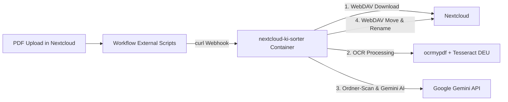

# Nextcloud KI-Sorter 🚀

Automatisierter Nextcloud Microservice für **OCR-Verarbeitung (`ocrmypdf`)** und **KI-basierte Dokumentensortierung & Umbenennung mit der Google Gemini API**.

---

## Funktionsweise



1. **PDF Upload:** Sobald eine PDF in Nextcloud hochgeladen wird (z. B. in den Ordner `/Posteingang`), löst Nextcloud über **Workflow External Scripts ("Abläufe")** einen Webhook an diesen Microservice aus.
2. **OCR Check:** Der Microservice prüft das PDF. Enthält es keinen oder zu wenig Text, wird automatisch `ocrmypdf` mit deutscher Sprachunterstützung (`deu+eng`) ausgeführt.
3. **Muster-Erkennung:** Der Service liest die vorhandene Ordnerstruktur unter `/Dokumente` auf Nextcloud sowie die darin bereits befindlichen Dateinamen aus.
4. **Google Gemini Analyse:** Die **Google Gemini API** analysiert den Dokumententext, wählt den am besten passenden Zielordner (z. B. `/Dokumente/Versicherungen/Auto`) und generiert einen einheitlichen Dateinamen passend zu deinen bestehenden Beispieldateien (z. B. `2024-05-15_HUK-Coburg_Beitragsrechnung.pdf`).
5. **WebDAV Einsortierung:** Die Datei wird per WebDAV API direkt in Nextcloud am richtigen Ort abgelegt und umbenannt.

---

## 🛠️ Schnellstart & Installation

### 1. Repository klonen & Umgebungs-Variablen anlegen

Kopiere die Vorlage `.env.example` nach `.env` und trage deine Zugangsdaten ein:

```bash
cp .env.example .env
```

Bearbeite `.env`:
```env
GEMINI_API_KEY=AIzaSy... (Dein Google Gemini API Key)
GEMINI_MODEL=gemini-2.5-flash
NEXTCLOUD_URL=https://deine-nextcloud-domain.de
NEXTCLOUD_USER=hermes
NEXTCLOUD_PASSWORD=dein_app_passwort
TARGET_ROOT_FOLDER=/Dokumente
INBOX_FOLDER=/Posteingang
```

> 💡 **Tipp:** Erstelle in Nextcloud unter **Persönliche Einstellungen -> Sicherheit -> App-Passwörter** ein eigenes App-Passwort für diesen Service.

---

### 2. Microservice per Docker Compose starten

```bash
docker-compose up -d --build
```

Der Server ist danach unter `http://localhost:8000` erreichbar.

---

### 2b. Installation auf Unraid OS

Für Unraid liegt die vorgefertigte Template-Datei [`unraid-template.xml`](file:///c:/Users/kaimmart/Documents/Nextcloud-KI-Sorter/unraid-template.xml) im Repository bereit:

1. Kopiere `unraid-template.xml` auf deinen Unraid-Server nach `/boot/config/plugins/dockerMan/templates-user/my-nextcloud-ki-sorter.xml`.
2. Gehe in Unraid auf den Reiter **Docker** -> unten auf **Add Container**.
3. Wähle oben bei *Template* das Template **my-nextcloud-ki-sorter** aus.
4. Alle Variablen (Gemini API Key, Nextcloud URL, User, Pass) sind bereits als Vorlage vorkonfiguriert und können in der Unraid-GUI angepasst werden.
5. Klicke auf **Apply**.

---

### 3. Nextcloud "Abläufe" (Workflow External Scripts) einrichten

1. Gehe in deine Nextcloud als Administrator auf **Apps**.
2. Suche nach der App **Workflow External Scripts** (`workflow_script`) und installiere sie.
3. Lege das Trigger-Skript `trigger_ki_sorter.sh` auf deinem Nextcloud-Server / Host ab (z. B. unter `/usr/local/bin/trigger_ki_sorter.sh`) und mache es ausführbar:
   ```bash
   chmod +x /usr/local/bin/trigger_ki_sorter.sh
   ```
4. Navigiere in Nextcloud zu **Verwaltungseinstellungen -> Abläufe (Flow)**.
5. Erstelle eine neue Regel:
   - **Name:** KI Dokumenteneinsortierung
   - **Verwende den Dienst:** `Skript ausführen`
   - **Bedingungen:**
     - `MIME-Typ der Datei` entspricht `application/pdf`
     - *(Optional)* `Pfad der Datei` beginnt mit `/Posteingang`
   - **Befehl / Skript:**
     `/usr/local/bin/trigger_ki_sorter.sh %n %a`

---

## 🧪 Manuelles Testen

Du kannst eine Datei auch manuell ohne Nextcloud-Workflow über die Kommandozeile testen:

```bash
# Per CLI im Container:
python main.py --file "/Posteingang/meine_test_rechnung.pdf" --user "hermes"

# Oder per cURL HTTP Request:
curl -X POST http://localhost:8000/process \
     -H "Content-Type: application/json" \
     -d '{"file_path": "Posteingang/meine_test_rechnung.pdf", "user": "hermes"}'
```

---

## 📄 Lizenz & Hinweise
Entwickelt für die nahtlose Integration mit Nextcloud WebDAV, `ocrmypdf` und Google Gemini API.
